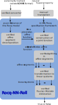

# The Rocq-NN-Roll Prover

## A Prover for Neural Network Hyperproperties Developed and Verified in Rocq

This repository contains a prototype for a tool called "Rocq-NN-Roll", a prover for piecewise affine neural networks developed and verified in Rocq. While scalability is a priority for most theorem provers, Rocq-NN-Roll tries to optimize for soundness and narrowing the gap between the verification envrionment in Rocq and the real world, e.g. by a trustworthy import mechanism of ONNX neural networks. This prototype offers a decision procedure for hyperproperties of real-valued piecewise-affine neural networks together with formal proofs on its soundness and completeness in Rocq, the first verified prover of its kind. The algorithm constructs an exponentially large piecewise affine function based on a neural network and its desired hyperproperty, and then solves a system of linear inequalities for each polyhedron in the constructed piecewise function. With Rocq-NN-Roll, you cannot only verify small neural networks without leaving Rocq, but it also opens a pathway for research on harder soundness issues within Rocq.

More about Rocq-NN-Roll in the paper: [ACCEPTED TO CAV 2026, COMING SOON]

### Requirements

Rocq-NN-Roll was developed with Coq Platform 2025.01.0 and depends on the standard library and Coquelicot 3.4.2 (included in the platform). The buid script was used with Python 3.13.2. To use the build script, ensure that "coqc" is in the PATH.

### Build

To build Rocq-NN-Roll, you need to generate the project file and compile the project using the Python script:
```
python build.py genprojf
python build.py compile
```

### Try It Out!

A good starting point is to consider the file `monotonicity1d.v` that showcases how to define a hyperproperty and verification functionality.

### Repository Overview


```
│   experiments\data.xlsx           <--- Data from verifying neural networks in benchmark.v
|   benchmark.v                     <--- Neural networks used for performance assesment in the paper
|   real_subsets.v                  <--- Definition of a computational subset of real numbers (real subset)
|   reals_real_subset.v             <--- Reals are its own subset (do not import, confuses Rocq)
|   real_subsets_instances.v        <--- Integers and rationals as real subsets
|   matrix_extensions.v             <--- Extensions of Coquelicot's matrix library
|   fourier_motzkin.v               <--- Implementation of Fourier-Motzkin Elimination
|   fm_q_support.v                  <--- Division in real subsets, support for division on rationals
|   piecewise_affine.v              <--- Formalization of piecewise-affine functions
|   pwaf_operations.v               <--- Composition and concatenation of piecewise-affine functions
|   neural_networks.v               <--- Formalization of neural networks and Affine Segment Decomposition (ASD)
|   neuron_functions.v              <--- Linear and ReLU layers
|   NNDH.v                          <--- Formalization of Neural Network Defined Hyperproperties (NNDH)
|   NNDH_to_fme.v                   <--- Verification algorithm
|   monotonicity1d.v                <--- Formalization of one-dimensional monotonicity for Rocq-NN-Roll
|   build.py                        <--- Python build script
|   rocq-nn-roll.svg
|   .gitignore
|   LICENSE
|   README.md
```

### Conceptual Chart


